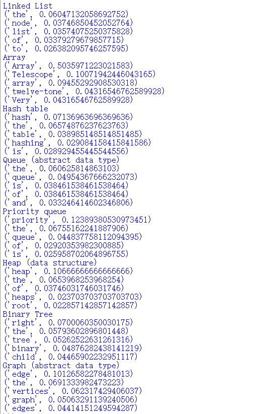
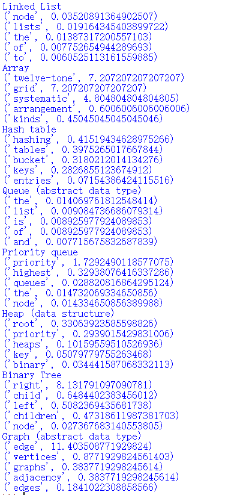

## Assignment2 test-mining
### 1.Project Review
In the program I use data source from wikipedia and TF-IDF to analyze them. I want to figure out that for some common data structures, which words are more important for these concepts.

### 2.Implementation
The program contains three parts.

* Part 1, initialize the data structure needed to be used and initialize the api of wikipedia. Part 2, 

* Part 2, For each data structure, get the text from its wikipedia website, and then count the number of occurrences of each word.

* Part 3, For each data structure,each words in the website, calculate their TF score and IDF score, multiply them and print.

Here are some algorithms used in code.

* Regular expression: It is often used to retrieve and replace text that matches a pattern. In this program, I use it to replace punctuation with spaces.

* String split: Turning text into words

* TF-IDF:Term Frequency–Inverse Document Frequency. It is used to assess the importance of a word to one of the documents in a document set or a corpus.

$$ tf_{i,j} = \frac{n_{i,j}}{\Sigma_k n_{k,j}}$$
$$ idf_i = lg \frac{|D|}{1+|\{j:t_i \in d_j
\}|}$$

* tf refers to the frequency with which a given word appears in that document.

* idf is a measure of the general importance of a word. The idf of a particular word can be obtained by dividing the total number of documents by the number of documents containing the word, and taking the quotient as a logarithm of 10.

Firstly, I try to just count the number of occurrence of each word and figure out which are more important. However, the results show that words such as 'the' 'of' are more important. It is obviously incorrect. And then I used TF-IDF to reduce this kind of impact. What's more, because of the goals, the data sourse from wikipedia is suitable due to it is the introduction and overview of the concept.
### 3.Results
As mentioned above, I firstly find the top ten words which has more tf scores for each data structure concept. Then calculate their tf-idf scores and show the 5 most important words for each.

Using TF-IDF is in order to exclude the effects of dummy words.But the results is not eliminate this effect once and for all.

I think it is because the frequency of words between such as 'the' and 'node' are e different. So I want to solve this problem by using another formula to calculate idf score which makes difference greater between common words and special words. What's more, 
I figure out that 'Array' and 'array' are regard as different words. And obviously, in the 'List' website, it is understandable that 'list' has high score so I want to overview this kind of words. Here are the results.

### 4.Reflection
(1). The rich function interface gives me the possibility to get data and I learned a lot about text processing directions and ideas.

(2). I think in this program I use a lot of priority knowledge such as I overview the same words as website titles. I hope to gaining more theoretical ground.

(3). The original results show a lot of problem of hypothesis and model. Then I solve them.

(4). I did not apply many techniques in the guidance. I want to learn more techniques and theory about text mining showed in the guidance.